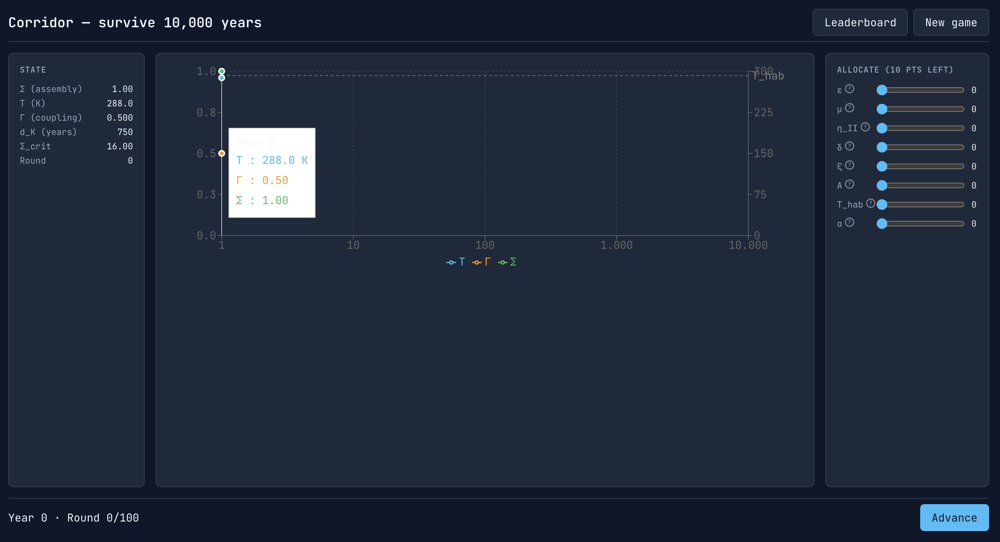

# Corridor

Turn-based civilisation survival game based on the thermodynamic corridor analysis. Steer a planetary civilisation through parameter space and survive 10,000 years without exceeding the viability kernel.

---

## Rules

### Goal

**Win:** Reach year 10,000 without extinction.  
**Lose:** Extinction when temperature exceeds the habitability limit (T > T_hab), assembly stock falls below the minimum (Σ < Σ_min), or the trajectory exits the viability kernel.

### Turn structure

1. **View state** — Σ (assembly stock), T (temperature), Γ (power–assembly coupling), d_K (years of runway to boundary)
2. **Receive events** — Random perturbations (recession, climate shock, tech breakthrough, etc.) may occur
3. **Allocate points** — Spend 10 points per turn across 8 parameters
4. **Advance** — Simulation steps forward 100 years

### Parameters (8 levers)

| Parameter | Effect |
|-----------|--------|
| **ε** | Decarbonisation — improves emissivity |
| **μ** | Institutional reform — metabolic multiplier; the discriminant |
| **η_II** | Efficiency — lowers power per output (subject to Jevons) |
| **δ** | Durability — lowers decay rate |
| **ξ** | Process innovation — lowers exergy cost |
| **A** | Space expansion — raises radiating ceiling |
| **T_hab** | Adaptation / SAI — shifts habitability threshold |
| **α** | Albedo engineering — strategic reserve |

### State display

- **Σ** — Assembly stock (total maintained structure)
- **T** — Equilibrium temperature (K)
- **Γ** — Power–assembly coupling (μδξ/η_II)
- **d_K** — Distance to kernel boundary (years of runway)
- **Σ_crit** — Braking boundary; stay below to remain viable

### Chart

The timeline shows Σ, T, and Γ over years (log scale, 1–10,000). The red line marks T_hab. Keep your trajectory inside the viable region.

---

## Setup

1. `npm install`
2. Copy `.env.example` to `.env` and set Supabase credentials
3. Run migration: paste `supabase/migrations/001_initial.sql` into Supabase SQL Editor
4. `npm run dev`

## Stack

- React + Vite + TypeScript
- Supabase (auth, Postgres leaderboard)
- Recharts, Framer Motion
